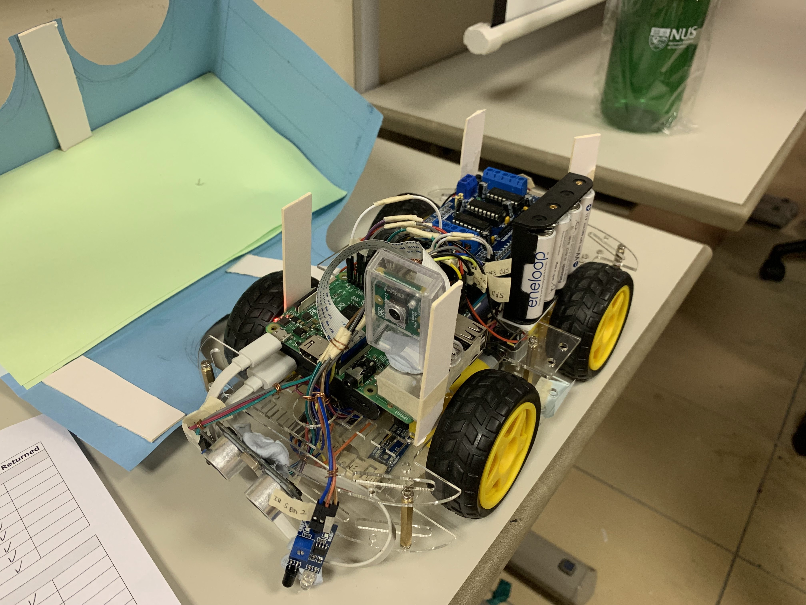

# Animal Radar
An animal-seeking robot with visual intelligence

National University of Singapore School of Computing (**NUS Computing**) Summer Workshop (2019): a team project

# Hardware

- Motors & sensors connected to Aduino
- Camera, control & connectivity (Wi-Fi) on Rasberry Pi
- Rasberry Pi powered by USB power bank (5V)
- Aduino motors powered by AA batteries

# Features
- **Following guiding marks** on the ground using IR sensors
- **Obsticle avoidance** using the ultrasonic sensor
- **Real-time video stream** from Rasberry Pi (Python script)
- **Look for animals and describe them**
  - OpenCV for enhancing video
  - YOLO3 for object detection
  - CNN & LSTM for image captioning 
  - TTS for audio message generation

# Project Poster

